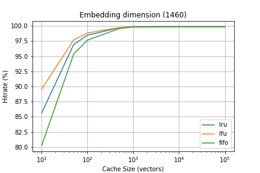
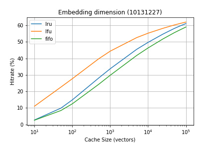
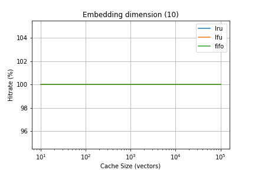
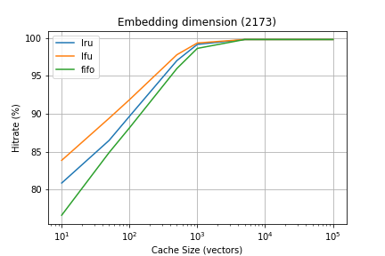

Week 2
============

### Weekly Log for Summer 2021 Internship at Facebook ###

Paper Summary
------------
[Deep Learning Recommendation Model forPersonalization and Recommendation Systems](https://arxiv.org/pdf/1906.00091.pdf)

[The Architectural Implications of Facebook’sDNN-based Personalized Recommendation](https://arxiv.org/pdf/1906.03109.pdf)

[RecNMP: Accelerating PersonalizedRecommendation with Near-Memory Processing](https://arxiv.org/pdf/1912.12953.pdf)

[Compositional Embeddings Using Complementary Partitions for Memory-Efficient Recommendation Systems](https://arxiv.org/pdf/1909.02107.pdf)

[Bandana: Using Non-volatile Memory for Storing Deep Learning Models](https://arxiv.org/pdf/1811.05922.pdf)

[Batch-Aware Unified Memory Management in GPUsfor Irregular Workloads](https://ramyadhadidi.github.io/files/kim-asplos20.pdf)

[Mixed Dimension Embeddings with Application toMemory-Efficient Recommendation Systems](https://arxiv.org/pdf/1909.11810.pdf)

[High-performance, Distributed Training of Large-scale DeepLearning Recommendation Models](https://arxiv.org/pdf/2104.05158.pdf)

[DeepRecSys: A System for Optimizing End-To-EndAt-scale Neural Recommendation Inference](https://arxiv.org/pdf/2001.02772.pdf)

[Adaptive GPU Cache Bypassing](https://www.computermachines.org/joe/publications/pdfs/gpgpu8_bypassing.pdf)

[Understanding Training Efficiency of DeepLearning Recommendation Models at Scale](https://arxiv.org/pdf/2011.05497.pdf)

Useful Blogs
------------
[Deep Learning Recommendation Machines — DLRM](https://medium.com/analytics-vidhya/deep-learning-recommendation-machines-dlrm-4fec2a5e7ef8)

[DALI](https://github.com/NVIDIA/dali)

[Deep Learning Recommendation Model (DLRM)](https://www.adityaagrawal.net/blog/dnn/dlrm)

[DLRM Pyprof](https://github.com/adityaiitb/dlperf/tree/master/Recommendation/DLRM)

DLRM Model Note
------------
1. Model simplified architecture overview:

2. Model parameters of representative recommendation models:

Embedding Table Note
------------
### General Note ###

| Dimension      | Description | 
| :---:       |    :----:   | 
| # of Category (\|S\|)     | $10^2$ - $10^6$       | 
| Vector Dimension (D) | $2^2$ - $2^7$         | 
| # of Embs | 8 - 64       | 

### Size Estimation ###

A size estimation of an embedding table with 
 1. |S| = $10^6$
 2. D = 128
 3. element type = fp32

Size = 4B $\times$ 128 $\times$ $10^6$ = **5.12 GB**

With 16 embs, total size = 5.12 $\times$ 16 = **81.92 GB**

### Cache Models ###

~~~python
'''
Test with different basic cache strategy
'''

# Different cache strategy: 
# 1: First-In/First-Out
# 2: Last-In/First-Out (Almost useless, no need to consider)
# 3: Least Recently Used
# 4: Most Recently Used
# 5: Least Frequently Used

from collections import defaultdict, OrderedDict # OrderedDict will track the insert order

class LFUCache:
    def __init__(self, capacity):
        self.capacity = capacity
        self.least_freq = 1

        # Use to track the items for each freq
        self.node_for_freq = defaultdict(OrderedDict)

        # Use to get the item (track it with the freq)
        self.node_for_key = dict()
        self.hit = 0
        self.count = 0
    
    def _update(self, key, value):
        '''
        If this item exists previously
        '''
        _, freq = self.node_for_key[key]
        
        # Update the item to the node_for_freq list
        self.node_for_freq[freq].pop(key) # Remove from freq
        self.node_for_freq[freq + 1][key] = (value, freq + 1) # Add to freq + 1

        # Check if need to increase least_freq
        if not len(self.node_for_freq[self.least_freq]):
            self.least_freq += 1
        
        # Update the node_for_key
        self.node_for_key[key] = (value, freq + 1)
    
    def get_hit_rate(self):
        return self.hit/self.count

    def get(self, key):
        self.count += 1
        if key not in self.node_for_key:
            return -1
        else:
            self.hit += 1
            value = self.node_for_key[key][0]
            self._update(key, value)
            return value
    
    def put(self, key, value):
        if key in self.node_for_key:
            self._update(key, value)
        else:
            self.node_for_key[key] = (value, 1) # Record the item together with the freq
            self.node_for_freq[1][key] = (value, 1) # Track the item, freq for each freq

            if not self.capacity:
                # If multiple items exist for one freq, remove the earliest one
                removed_key = self.node_for_freq[self.least_freq].popitem(last=False)[0]

                # Pop the item from the node_for_key
                self.node_for_key.pop(removed_key)

            else:
                self.capacity -= 1
            self.least_freq = 1

class LRUCache:
    '''
    Typically the capacity is the required input
    '''
    def __init__(self, capacity):
        self.cache = OrderedDict()
        self.capacity = capacity
        self.hit = 0
        self.count = 0
    
    def get_hit_rate(self):
        return self.hit/self.count

    def get(self, key):
        self.count += 1
        if key not in self.cache:
            return -1
        else:
            self.hit += 1
            self.cache.move_to_end(key)
            return self.cache[key]
    
    def put(self, key, value):
        self.cache[key] = value
        self.cache.move_to_end(key)
        if len(self.cache) > self.capacity:
            self.cache.popitem(last=False) # last=False ==> FIFO

class MRUCache:
    '''
    Typically the capacity is the required input
    '''
    def __init__(self, capacity):
        self.cache = OrderedDict()
        self.capacity = capacity

    def get_hit_rate(self):
        return self.hit/self.count

    def get(self, key):
        if key not in self.cache:
            return -1
        else:
            self.cache.move_to_end(key)
            return self.cache[key]
    
    def put(self, key, value):
        self.cache[key] = value
        self.cache.move_to_end(key)
        if len(self.cache) > self.capacity:
            self.cache.popitem(last=True) # last=True ==> LIFO

class FIFOCache:
    '''
    Typically the capacity is the required input
    '''
    def __init__(self, capacity):
        self.cache = OrderedDict()
        self.capacity = capacity
        self.hit = 0
        self.count = 0

    def get(self, key):
        self.count += 1
        if key not in self.cache:
            return -1
        else:
            self.hit += 1
            return self.cache[key]
    def get_hit_rate(self):
        return self.hit/self.count
        
    def put(self, key, value):
        self.cache[key] = value
        if len(self.cache) > self.capacity:
            self.cache.popitem(last=False) # last=False ==> FIFO
~~~

Dataset Note
------------

#### 1. [Criteo Kaggle Display Advertising Challenge Dataset](https://labs.criteo.com/2014/02/kaggle-display-advertising-challenge-dataset) #### 

 * This dataset is actually used in the original DLRM paper, two versions:
   * Kaggle Competition (~10 GB), I just studied this dataset
   * Terabite Version (~1 TB), too large for my computer

 * Data Format: Id +  13 dense features + 26 categorical features
  
 * Total Number of data: 
  
   * 39291958 training data
   * 3273440 testing data

* Training data dimension for each category feature:
  [    1460,      583, 10131227,  2202608,      305,       24,
          12517,      633,        3,    93145,     5683,  8351593,
           3194,       27,    14992,  5461306,       10,     5652,
           2173,        4,  7046547,       18,       15,   286181,
            105,   142572]

**Note**: 

  * Each categorical feature has one embedding table, in order to fully utilize the embedding table, the |S| of each embdding table is set to the same as the category dimension.

  * Vector Dimension D is set to be 128 (won't be used in the preliminary test).

**Three Cache Policies**:

  * LRU, LFU, FIFO

**Preliminary Test**:

The total number of requests = 1,000,000 from the training set

|      |  | 
| :---:       |    :----:   | 
|      |        | 
|      |        | 
|      |        | 
|      |        | 
|      |        | 
|      |        | 
|      |        | 
|      |        | 
|      |        | 
|      |        | 
|      |        | 
|      |        | 

**Observation**

  * When the embedding dimension is small, the hit rate will increase really fast to almost 100% as the cache size increases.
  
  * When the embedding dimension is smaller than the cache size, the cache hit rate will be 100%.

  * In general, LFU policy has the best performance and FIFO policy has the worst performance.

#### 2. Synthetic Dataset #### 

 * Investigate four embedding tables with with |S| = [10,000, 100,000, 1,000,000, 10,000,000]

 * Each random data loader also generate indicies within the previous four ranges.
  
___a. Uniform Distributed Generator___

**Three Cache Policies**:

  * LRU, LFU, FIFO

**Preliminary Test**:

The total number of requests = 1,000,000

|      |  | 
| :---:       |    :----:   | 
|      |        | 

**Observation**

 * All three policies performs almost the same.

 * The hit rate $\approx$ cache_size/embedding_dimension

___b. Gaussian Distributed Generator___

**Three Cache Policies**:

  * LRU, LFU, FIFO

**Preliminary Test**:

The total number of requests = 1,000,000

mean = max_index + min_index / 2

standard deviation = mean / 4

|      |  | 
| :---:       |    :----:   | 
|      |        | 

**Observation**

 * In general the hit rate is higher than random data generator (2.5 * cache_size/embedding_dimension).

 * The trend is simliar to random data generator.

Todos
------------

* Analysis runtime for each policy

* Increase the request query number (current is 1,000,000)

Potential methods to improve the cache policy
------------

* In general, I feel this direction does have some space to improve. As shown in the Criteo Kaggle dataset study, for embedding table 3 & 12, with cache size = $10^5$ (suppose the vector dimension is 128 and data type is fp32, # of embedding table = 26, total embedding table cache size = $10^5 \times 128 \times 4\ B \times 32 = 1.63\ GB$), the cache hit rate is around 60%.

* Find Related Vectors: The main idea is that related vectors are more likely to be queried within a short amount of time. (This idea is inspired from [BANDANA](https://arxiv.org/pdf/1811.05922.pdf))
  
  * Clustering Method to find the similar vector (in terms of the Euclidian space) of the embedding tables after each training epoch. This approach is independent of the query pattern but is hard to scale.

  * Supervised Partitioning with [SHP](http://www.vldb.org/pvldb/vol10/p1418-pupyrev.pdf) method, this method relies on the past access patterns of each vector.

  * Other similarity metrics...

  * Todo: Probably we can combine those two methods together to consider both the embedding table features as well as the access patterns of the incoming queries...

* Improve the cache policy (rather than LRU, LFU and FIFO): There are many existing cache replacement policies, could find the optimal for recommender system based on the access query patterns:
  * Bélády's algorithm
  * First in first out (FIFO): Tested
  * Last in first out (LIFO) or First in last out (FILO)
  * Least recently used (LRU): Tested
  * Time aware least recently used (TLRU)
  * Most recently used (MRU)
  * Pseudo-LRU (PLRU)
  * Random replacement (RR)
  * Segmented LRU (SLRU)
  * Least-frequently used (LFU): Tested
  * Least frequent recently used (LFRU)
  * LFU with dynamic aging (LFUDA)
  * Low inter-reference recency set (LIRS)
  * CLOCK-Pro
  * Adaptive replacement cache (ARC)
  * AdaptiveClimb (AC): similar idea used in hill-climbing based scheduler from [DeepRecSys](https://arxiv.org/pdf/2001.02772.pdf)
  * Clock with adaptive replacement (CAR)
  * Multi queue (MQ)
  * Pannier: Container-based caching algorithm for compound objects

